# Microservices-Task

## Overview
This document provides details on testing various services after running the `docker-compose` file. These services include User, Product, Order, and Gateway Services. Each service has its own endpoints for testing purposes.

---

### Clone the repo in your vm
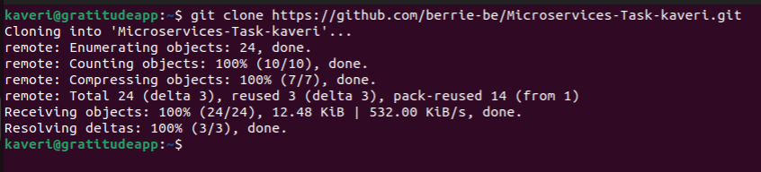

### Now start writing dockerfiles for all the four services in the project.
#### We have to make sure that right port number is exposed in the dockerfiles.
### Port number can be found in app.js file of each service


### User-service
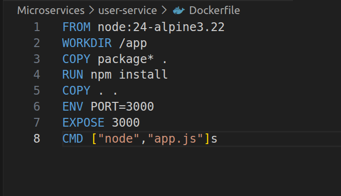

### Product-service
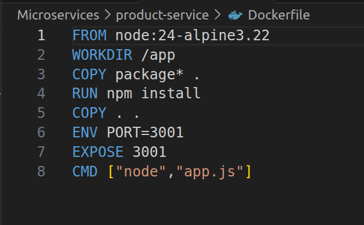

### Order-service
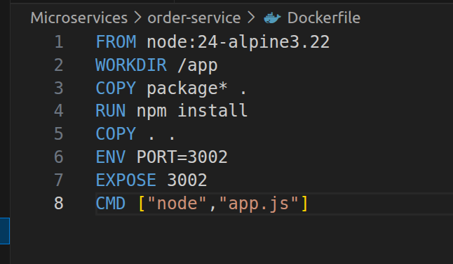

### Gateway-service
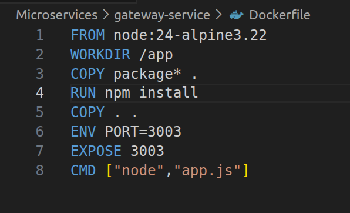

#### Once Dockerfile is written, we have to start with the docker compose file so that we can build the application at one go with all the services.
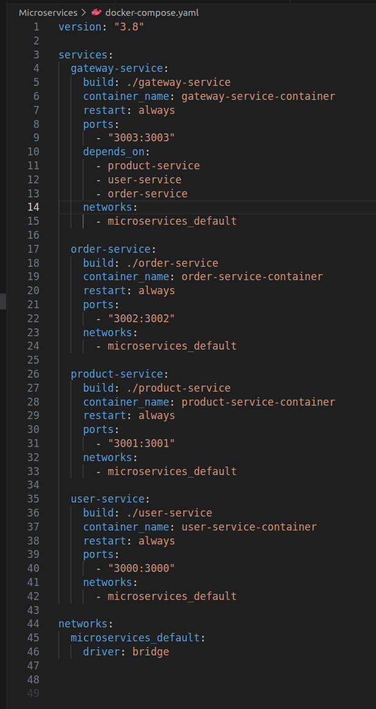

#### Start building the application with the below command
docker-compose up -d --build

#### Once all the images are created and containers are created, check the container status
docker ps - for checking container status

### Check the services are healthy or not
### User-service (Port - 3000)
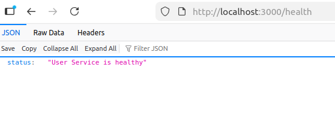

### Product-service (Port - 3001)
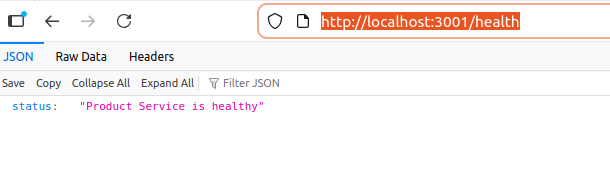

### Order-service (Port - 3002)
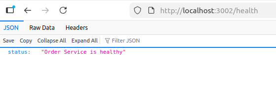

### Gateway-service (Port - 3003)
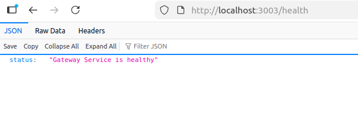


Now check all the endpoints

## Services and Endpoints

### **User Service**
- **Base URL:** `http://localhost:3000`
- **Endpoints:**
  - **List Users:**  
    ```
    curl http://localhost:3000/users
    ```
    Or open in your browser: [http://localhost:3000/users](http://localhost:3000/users)

  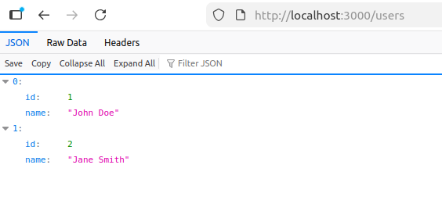

---

### **Product Service**
- **Base URL:** `http://localhost:3001`
- **Endpoints:**
  - **List Products:**  
    ```
    curl http://localhost:3001/products
    ```
    Or open in your browser: [http://localhost:3001/products](http://localhost:3001/products)

  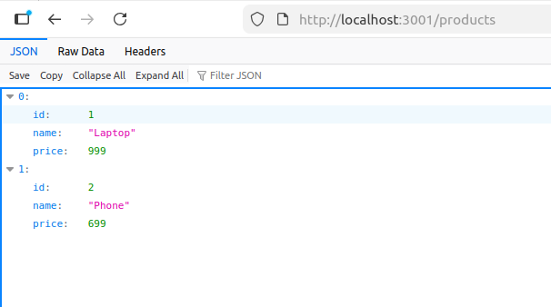
---

### **Order Service**
- **Base URL:** `http://localhost:3002`
- **Endpoints:**
  - **List Orders:**  
    ```
    curl http://localhost:3002/orders
    ```
    Or open in your browser: [http://localhost:3002/orders](http://localhost:3002/orders)

    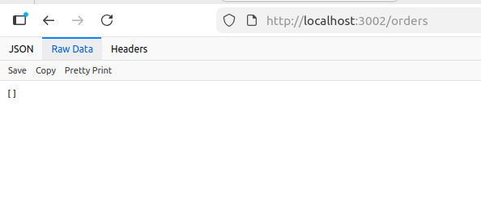
---

### **Gateway Service**
- **Base URL:** `http://localhost:3003/api`
- **Endpoints:**
  - **Users:**  
    ```
    curl http://localhost:3003/api/users
    ```
  - **Products:**  
    ```
    curl http://localhost:3003/api/products
    ```
  - **Orders:**  
    ```
    curl http://localhost:3003/api/orders
    ```
    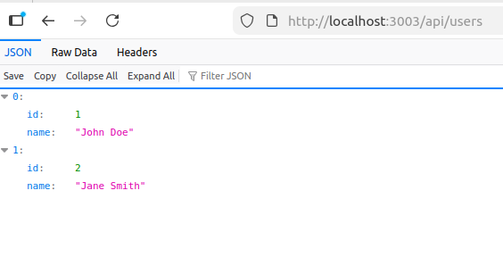
    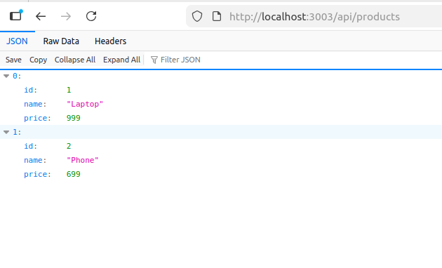
    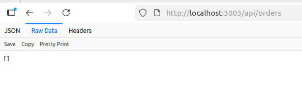
---

