# Microservices-Task

## Overview
This document provides details on testing various services after running the `docker-compose` file. These services include User, Product, Order, and Gateway Services. Each service has its own endpoints for testing purposes.

---

### Clone the repo in your vm
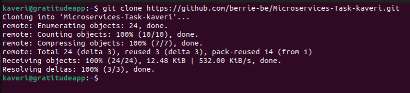

### Now start writing dockerfiles for all the four services in the project.
#### We have to make sure that right port number is exposed in the dockerfiles.
### Port number can be found in app.js file of each service


### User-service
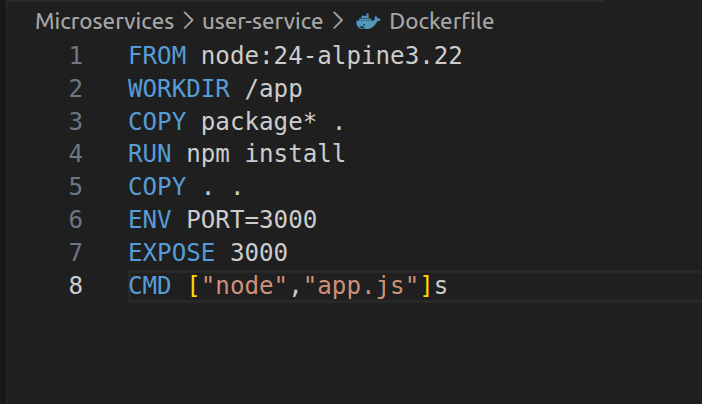

### Product-service
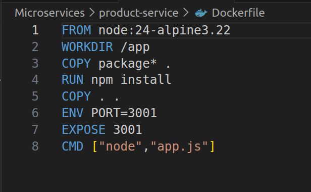

### Order-service
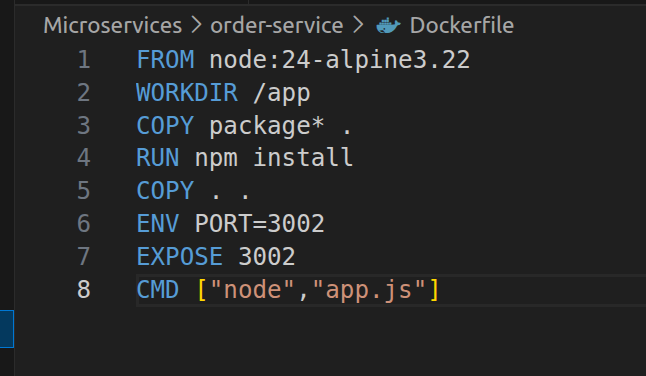

### Gateway-service
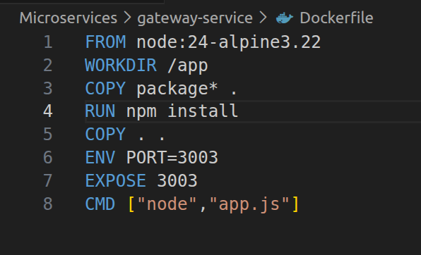

#### Once Dockerfile is written, we have to start with the docker compose file so that we can build the application at one go with all the services.
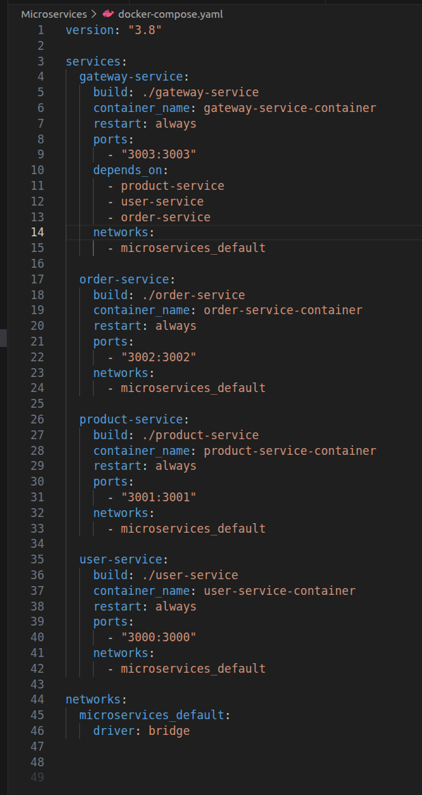

#### Start building the application with the below command
docker-compose up -d --build

#### Once all the images are created and containers are created, check the container status
docker ps - for checking container status
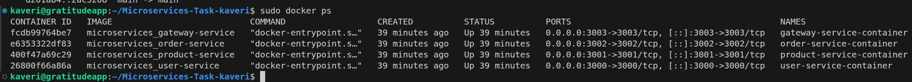

### Check the services are healthy or not
### User-service (Port - 3000)
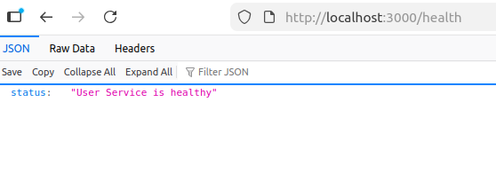

### Product-service (Port - 3001)
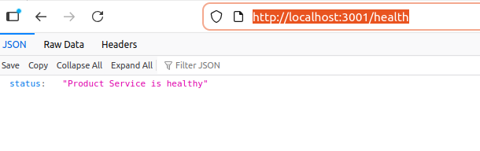

### Order-service (Port - 3002)
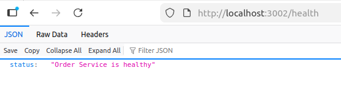

### Gateway-service (Port - 3003)
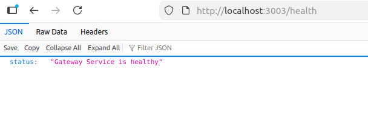


Now check all the endpoints

## Services and Endpoints

### **User Service**
- **Base URL:** `http://localhost:3000`
- **Endpoints:**
  - **List Users:**  
    ```
    curl http://localhost:3000/users
    ```
    Or open in your browser: [http://localhost:3000/users](http://localhost:3000/users)

  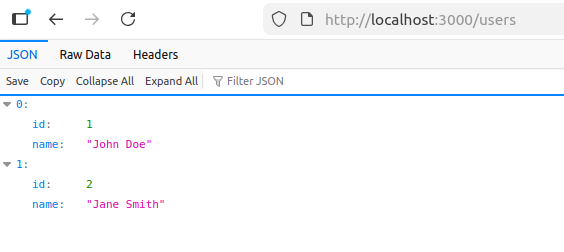

---

### **Product Service**
- **Base URL:** `http://localhost:3001`
- **Endpoints:**
  - **List Products:**  
    ```
    curl http://localhost:3001/products
    ```
    Or open in your browser: [http://localhost:3001/products](http://localhost:3001/products)

  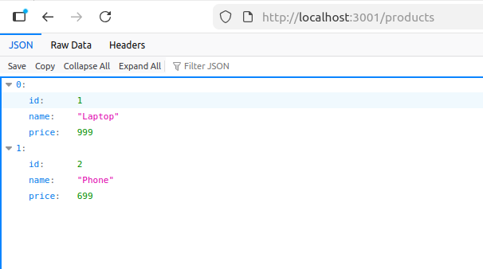
---

### **Order Service**
- **Base URL:** `http://localhost:3002`
- **Endpoints:**
  - **List Orders:**  
    ```
    curl http://localhost:3002/orders
    ```
    Or open in your browser: [http://localhost:3002/orders](http://localhost:3002/orders)

    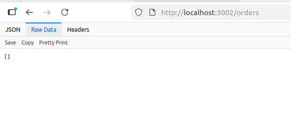
---

### **Gateway Service**
- **Base URL:** `http://localhost:3003/api`
- **Endpoints:**
  - **Users:**  
    ```
    curl http://localhost:3003/api/users
    ```
  - **Products:**  
    ```
    curl http://localhost:3003/api/products
    ```
  - **Orders:**  
    ```
    curl http://localhost:3003/api/orders
    ```
    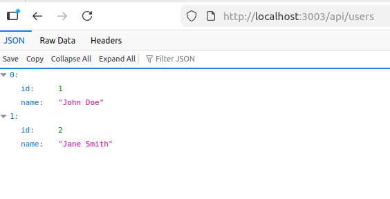
    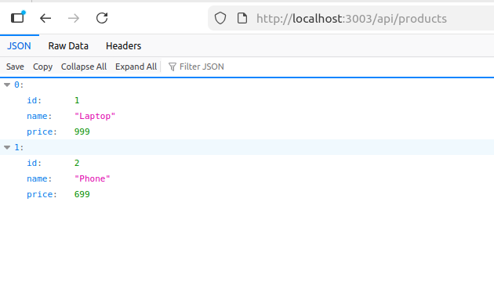
    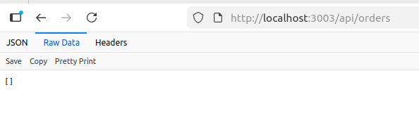
---


# Skill Test 2 Steps

### Push the docker images to the dockerhub
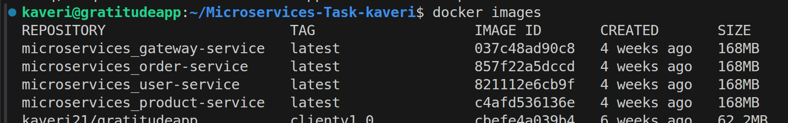
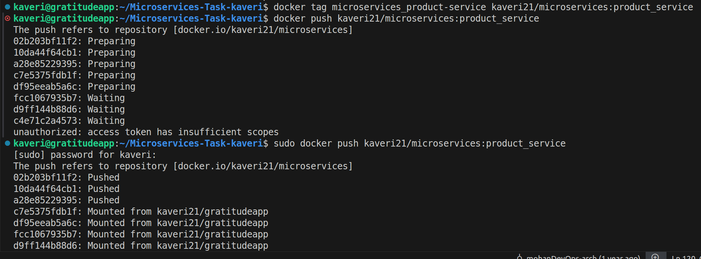
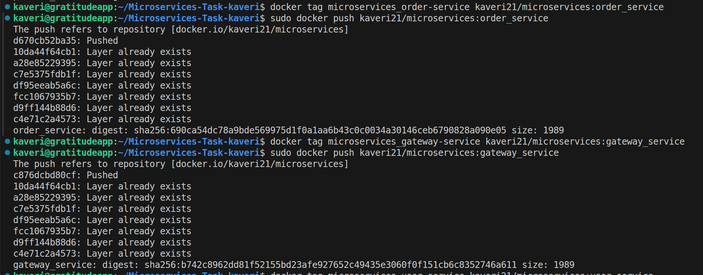
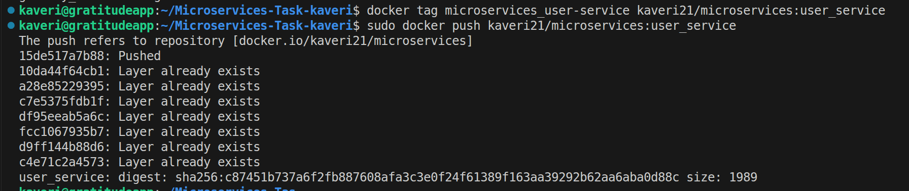

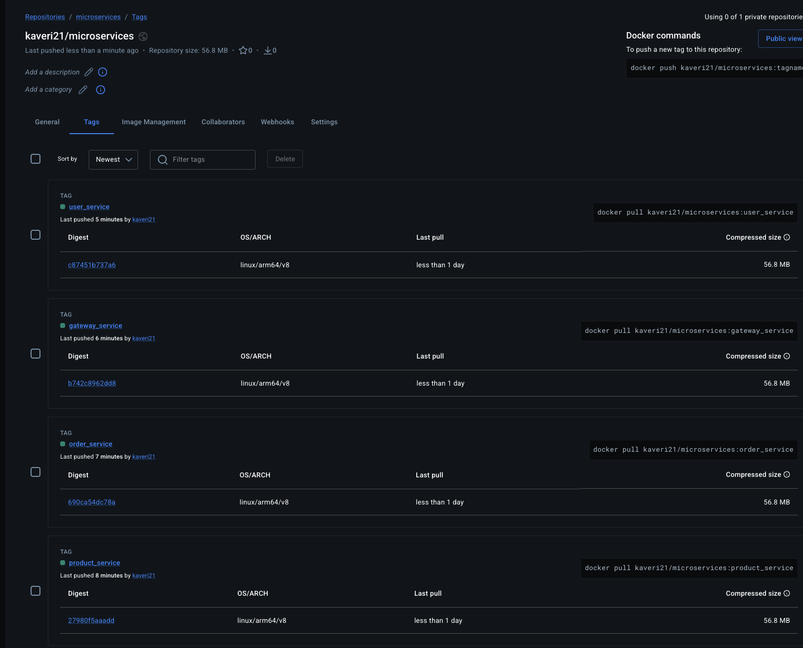

### Create deployment file and service files for the services
You can check the files in the deployment and services folder

### Install Minikube and start it using the below commands
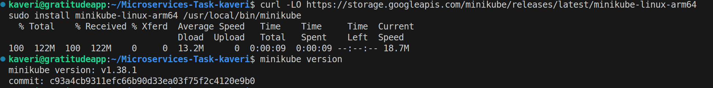

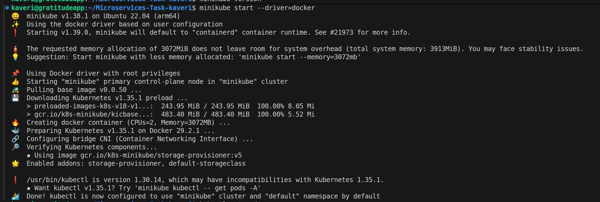
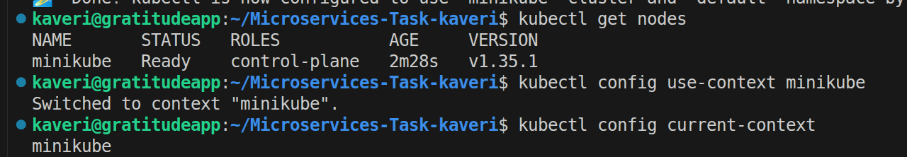

### Now apply the deployment and services file using the below command
kubectl apply -f filename

Once done verify pods and services like below
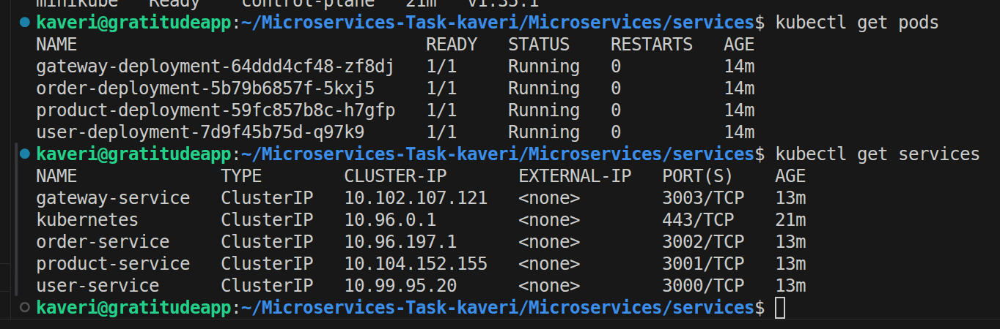

Once you have verified everything is running properly, please check all the endpoints of the services if it is working on it.

Go to the cluster first using below command
kubectl run debug --rm -it --image=curlimages/curl -- sh

now check the endpoints with /health
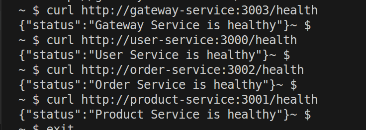
